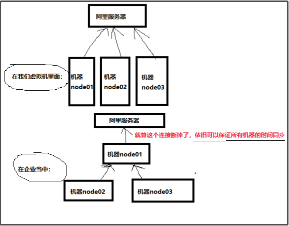
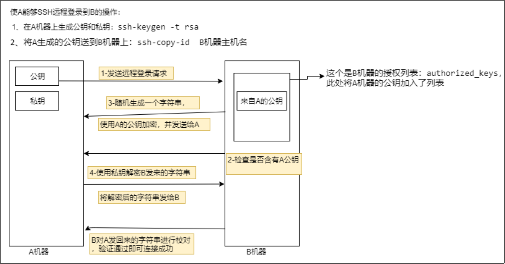

## hadoop集群规划信息

- `node01 192.168.52.101`
- `node02 192.168.52.102`
- `node03 192.168.52.103`

:warning: 本文使用centos7系统作为演示

## 创建node01虚拟机

#### 配置静态IP：

```sh
vi /etc/sysconfig/network-scripts/ifcfg-ens33 

BOOTPROTO="static" 
IPADDR=192.168.52.101 （要跟虚拟机编辑器网段一样）
NETMASK=255.255.255.0 
GATEWAY=192.168.52.2 (要跟虚拟机编辑器设置一样) 
DNS1=114.114.114.114
```

#### 关闭防火墙

```sh
systemctl stop firewalld //停止防火墙
systemctl disable firewalld //禁止自启动
```

#### 关闭selinux服务 

```sh
vim /etc/selinux/config 

SELINUX=disabled
```

#### 更改主机名

```sh
hostnamectl set-hostname node01   #此方法不用重启
```

#### 配置IP映射

```java
vim /etc/hosts
//添加以下内容
192.168.52.101 node01
192.168.52.102 node02
192.168.52.103 node03
```


## 克隆虚拟机

根据`node01`克隆出`node02、node03`，克隆方式使用完整克隆，**需要node01先关机**。

#### 修改node02/03的ip地址

```Java
vi /sysconfig/network-scripts/ifcfg-ens33

//node02修改ip为102
IPADDR=192.168.52.102
//node03修改ip为103
IPADDR=192.168.52.103
```

#### 修改node02/03的主机名

```sh
hostnamectl set-hostname node02
hostnamectl set-hostname node03
```

#### 检查node02/03

检查`node02、node03`是否确实关闭防火墙和`selinux`服务了

```sh
systemctl status firewalld
vim /etc/selinux/config
```


## 所有机器同步时间

同步阿里云时间：

```sh
yum -y install ntpdate #一定要先安装ntpdate！！！

#使用crt，同时给三个节点发送下列命令
crontab -e  （按i进行编辑）

#每个节点都添加以下内容，然后保存退出。
*/1 * * * * /usr/sbin/ntpdate time1.aliyun.com
#每隔一分钟执行一次命令/usr/sbin/ntpdate time1.aliyun.com来更新同步linux的系统时间

#定时更新同步linux的系统时间后，在linux每次关机的时候都会将系统时间同步到硬件时间。
#date命令查看的是硬件时间。将系统时间同步到硬件时间的命令是hwclock --systohc
```

时间同步的原理：



:::tip

linux定时任务的解释：

```sh
0    12   *   *   *   mail dmtsai -s "at 12:00" < /home/dmtsai/.bashrc
#分  时   日   月  周  |《==============命令行=======================》|
```

| 特殊字符 | 代表意义                                                     |
| -------- | ------------------------------------------------------------ |
| `*`      | 代表任何时刻都接受的意思。举例来说，范例一内那个日、月、周都是*，就代表着不论何月、何日的礼拜几的12：00都执行后续命令的意思。 |
| `,`      | 代表分隔时段的意思。举例来说，如果要执行的工作是`3:00`与`6:00`时，<br />就会是：`0 3,6 * * * command` 时间还是有五列，不过第二列是 3,6 ，代表3与6都适用 |
| `-`      | 代表一段时间范围内，举例来说，8点到12点之间的每小时的20分都进行一项工作：20 8-12 * * * command仔细看到第二列变成8-12 , 代表 8,9,10,11,12 都适用的意思 |
| `/n`     | 那个n代表数字，即是每隔n单位间隔的意思，例如每五分钟进行一次，<br />则：`*/5 * * * * command`用*与/5来搭配，也可以写成 0-59/5，意思相同 |

:::           


## 所有机器添加普通用户

三台机器添加普通用户`hadoop`，密码设为`hadoop`,为普通用户添加`sudo`权限

```sh
useradd hadoop
passwd hadoop（密码三台机器都设为hadoop）
```

  为普通用户添加`sudo`权限：

```sh
visudo
 
root    ALL=(ALL)       ALL
hadoop  ALL=(ALL)       ALL 
```


## 所有机器统一目录

```sh
mkdir -p /kkb/soft   ## 软件压缩包存放目录 
mkdir -p /kkb/install  ## 软件解压后存放目录 
chown -R hadoop:hadoop /kkb   ## 将文件夹权限更改为hadoop用户
```

## 配置免密登录

为所有机器之间的hadoop用户配置免密登录，每个机器要相互间都能远程免密连接，则都要产生公钥和私钥，并将自身公钥分发到其它所有的机器。

1、切换到`hadoop`用户进行操作： `su - hadoop`

2、所有机器执行 `ssh-keygen -t rsa` 

3、三台机器在`hadoop`用户下，执行以下命令将公钥拷贝到`node01`服务器上面去 

```sh
ssh-copy-id node01 
```

4、`node01`在`hadoop`用户下，执行以下命令，将`authorized_keys`拷贝到`node02`与`node03`服务器 

```sh
cd /home/hadoop/.ssh/   #cd ~/.ssh/
scp authorized_keys node02:$PWD 
scp authorized_keys node03:$PWD
```

5、三台机器修改hadoop用户的公钥和私钥的权限

```sh
chmod -R 755 ~/.ssh/
cd ~/.ssh/
chmod 644 *
chmod 600 id_rsa
chmod 600 id_rsa.pub
cat id_rsa.pub >> authorized_keys  #这步可能不需要了
```

:::tip

**A节点免密码远程连接到B节点的原理：**



:::

## 所有机器配置java环境

#### 三台机器上传安装包jdk

```sh
yum install lrzsz
cd /kkb/soft
rz
tar -zxvf /kkb/soft/jdk-8u141-linux-x64.tar.gz -C /kkb/install/
```

#### 三台机器配置Java环境变量

```sh
vi /home/hadoop/.bash_profile
export JAVA_HOME=/kkb/install/jdk1.8.0_141 
export PATH=此处添加 :$JAVA_HOME/bin

source /home/hadoop/.bash_profile
```


## node01安装hadoop

#### node01上传编译后的安装包hadoop

```sh
cd /kkb/soft
rz
tar -zxvf /kkb/soft/ -C /kkb/install/
```

:::warning

本文hadoop集群的安装，使用的是**CDH的hadoop安装包**，后面会介绍CDH版本与apache版本的区别。

[点击此处下载CDH版本的hadoop源码包](http://archive.cloudera.com/cdh5/cdh/5/hadoop-2.6.0-cdh5.14.2-src.tar.gz)

CDH的所有安装包版本都给出了对应的软件版本，一般情况下是不需要自己进行编译的，但是由于cdh给出的hadoop的安装包没有提供带C程序访问的接口，所以我们在使用本地库（本地库可以用来做压缩，以及支持C程序等等）的时候就会出问题。

[点击此处查看CDH hadoop安装包的编译方法](https://blog.csdn.net/weixin_42582592/article/details/83000529)

:::

#### node01配置Hadoop环境变量

```sh
vi /home/hadoop/.bash_profile

export HADOOP_HOME=/kkb/install/
export PATH=此处添加 :$HADOOP_HOME/bin:$HADOOP_HOME/sbin

source /home/hadoop/.bash_profile 
```

#### node01查看hadoop支持的压缩方式以及本地库 

```sh
cd /kkb/install/hadoop-2.6.0-cdh5.14.2/bin

hadoop checknative
```

:warning:如果出现`openssl`为`false`，那么所有机器在线安装`openssl`即可，执行以下命令，虚拟机联网之后就可以在线进行安装了: `yum -y install openssl-devel` 

#### node01配置hadoop配置文件

进入到配置文件目录：

```sh
cd /kkb/install/hadoop-2.6.0-cdh5.14.2/etc/hadoop/
```

修改hadoop-env.sh

```sh
vi hadoop-env.sh
export JAVA_HOME=/kkb/install/jdk1.8.0_141
```

修改core-site.xml

```xml
<configuration>
        <property>
                <name>fs.defaultFS</name>
                <value>hdfs://node01:8020</value>
        </property>
        <property>
                <name>hadoop.tmp.dir</name>
                <value>/kkb/install/hadoop-2.6.0-cdh5.14.2/hadoopDatas/tempDatas</value>
        </property>
        <!--  缓冲区大小，实际工作中根据服务器性能动态调整 -->
        <property>
                <name>io.file.buffer.size</name>
                <value>4096</value>
        </property>
                <!--  开启hdfs的垃圾桶机制，删除掉的数据可以从垃圾桶中回收，单位分钟 -->
        <property>
                <name>fs.trash.interval</name>
                <value>10080</value>
        </property>
        <property>
                <name>fs.trash.checkpoint.interval</name>
                <value>0</value>
        </property>
</configuration>
```

修改hdfs-site.xml

```xml
    <!-- NameNode存储元数据信息的路径，实际工作中，一般先确定磁盘的挂载目录，然后多个目录用，进行分割   --> 
    <!--   集群动态上下线 
    <property>
        <name>dfs.hosts</name>
        <value>/kkb/install/hadoop-2.6.0-cdh5.14.2/etc/hadoop/accept_host</value>
    </property>
    <property>
        <name>dfs.hosts.exclude</name>
        <value>/kkb/install/hadoop-2.6.0-cdh5.14.2/etc/hadoop/deny_host</value>
    </property>
     -->
     <property>
            <name>dfs.namenode.secondary.http-address</name>
            <value>node01:50090</value>
    </property>
    <property>
        <name>dfs.namenode.http-address</name>
        <value>node01:50070</value>
    </property>
    <property>
        <name>dfs.namenode.name.dir</name>
        <value>file:///kkb/install/hadoop-2.6.0-cdh5.14.2/hadoopDatas/namenodeDatas</value>
    </property>
    <!--  定义dataNode数据存储的节点位置，实际工作中，
	一般先确定磁盘的挂载目录，然后多个目录用，进行分割  -->
    <property>
        <name>dfs.datanode.data.dir</name>
        <value>file:///kkb/install/hadoop-2.6.0-cdh5.14.2/hadoopDatas/datanodeDatas</value>
    </property>
    <property>
        <name>dfs.namenode.edits.dir</name>
        <value>file:///kkb/install/hadoop-2.6.0-cdh5.14.2/hadoopDatas/dfs/nn/edits</value>
    </property>
    <property>
        <name>dfs.namenode.checkpoint.dir</name>
        <value>file:///kkb/install/hadoop-2.6.0-cdh5.14.2/hadoopDatas/dfs/snn/name</value>
    </property>
    <property>
        <name>dfs.namenode.checkpoint.edits.dir</name>
        <value>file:///kkb/install/hadoop-2.6.0-cdh5.14.2/hadoopDatas/dfs/nn/snn/edits</value>
    </property>
    <property>
        <name>dfs.replication</name>
        <value>2</value>
    </property>
    <property>
        <name>dfs.permissions</name>
        <value>false</value>
    </property>
<property>
        <name>dfs.blocksize</name>
        <value>134217728</value>
    </property>

```

修改mapred-site.xml

```sh
mv mapred-site.xml.template mapred-site.xml
```

```xml
<configuration>
    <property>
        <name>mapreduce.framework.name</name>
        <value>yarn</value>
    </property>
    <property>
        <name>mapreduce.job.ubertask.enable</name>
        <value>true</value>
    </property>
    <property>
        <name>mapreduce.jobhistory.address</name>
        <value>node01:10020</value>
    </property>
    <property>
        <name>mapreduce.jobhistory.webapp.address</name>
        <value>node01:19888</value>
    </property>
</configuration>
     
```

修改yarn-site.xml

```xml
<configuration>
        <!-- Site specific YARN configuration properties -->
        <property>
                <name>yarn.resourcemanager.hostname</name>
                <value>node01</value>
        </property>
        <property>
                <name>yarn.nodemanager.aux-services</name>
                <value>mapreduce_shuffle</value>
        </property>
</configuration>

```

修改node01编辑slaves

```Java
cd /kkb/install/hadoop-2.6.0-cdh5.14.2/etc/hadoop
vim slaves 

node01 //(加入这里不写node01的话，启动集群不会在node01启动datanode，即从节点)
node02 
node03
```

修改node01创建文件存放目录

```sh
mkdir -p /kkb/install/hadoop-2.6.0-cdh5.14.2/hadoopDatas/tempDatas 
mkdir -p /kkb/install/hadoop-2.6.0-cdh5.14.2/hadoopDatas/namenodeDatas 
mkdir -p /kkb/install/hadoop-2.6.0-cdh5.14.2/hadoopDatas/datanodeDatas 
mkdir -p /kkb/install/hadoop-2.6.0-cdh5.14.2/hadoopDatas/dfs/nn/edits
mkdir -p /kkb/install/hadoop-2.6.0-cdh5.14.2/hadoopDatas/dfs/snn/name 
mkdir -p /kkb/install/hadoop-2.6.0-cdh5.14.2/hadoopDatas/dfs/nn/snn/edits
```

## 分发hadoop安装包

分发node01的hadoop安装包到node02、node03：

```sh
cd /kkb/install/

scp -r hadoop-2.6.0-cdh5.14.2/ node02:/kkb/isntall/
scp -r hadoop-2.6.0-cdh5.14.2/ node03:/kkb/install/
```

配置node02/03的hadoop 环境变量：

```sh
vi /home/hadoop/.bash_profile

export HADOOP_HOME=/kkb/install/hadoop-2.6.0-cdh5.14.2
export PATH=此处添加 :$HADOOP_HOME/bin:$HADOOP_HOME/sbin
```

node02/node03安装`openssl-devel`

```sh
sudo yum -y install openssl-devel
```


## 格式化hadoop

:::warning

只在node01节点格式化,不能重新格式化，只能格式化一次。

**首次启动**HDFS时，必须对其进行格式化操作。**本质上是一些清理和准备工作**，因为此时的 HDFS 在物理上还是不存在的。

:::

要启动 Hadoop 集群，需要启动 HDFS 和 YARN 两个集群。

```sh
cd /kkb/install/hadoop-2.6.0-cdh5.14.2/bin/

#执行下面其中一个命令：
hdfs namenode -format
#或者
hadoop namenode –format
```

